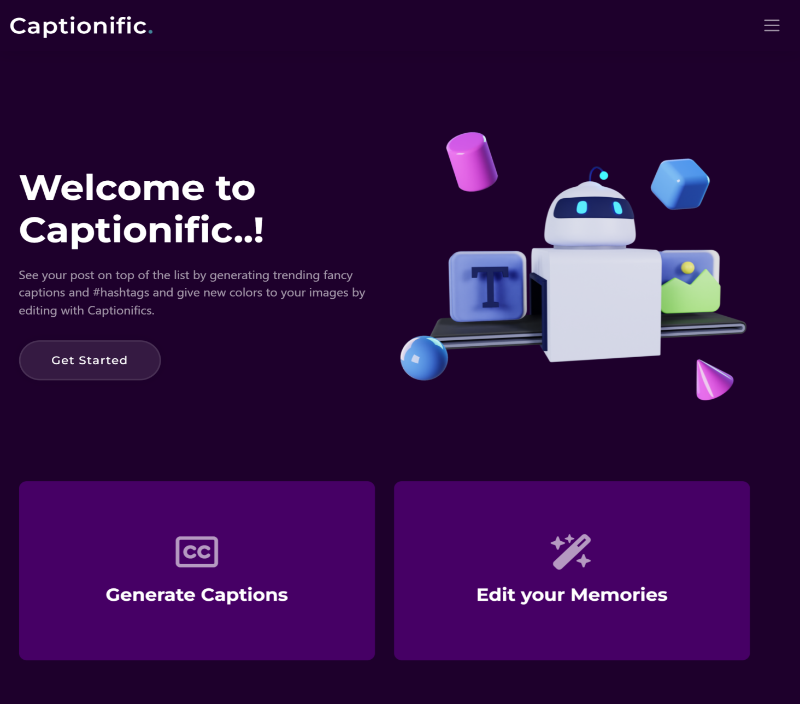
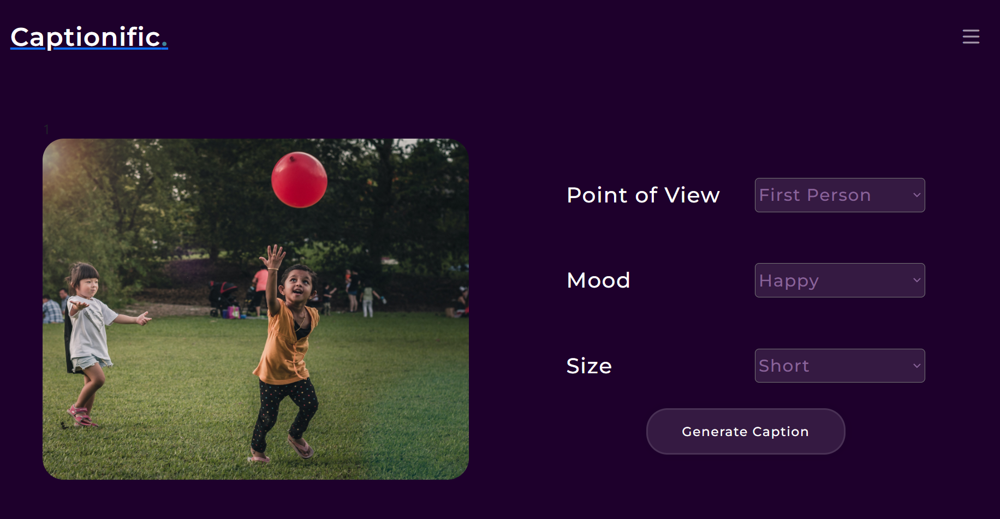
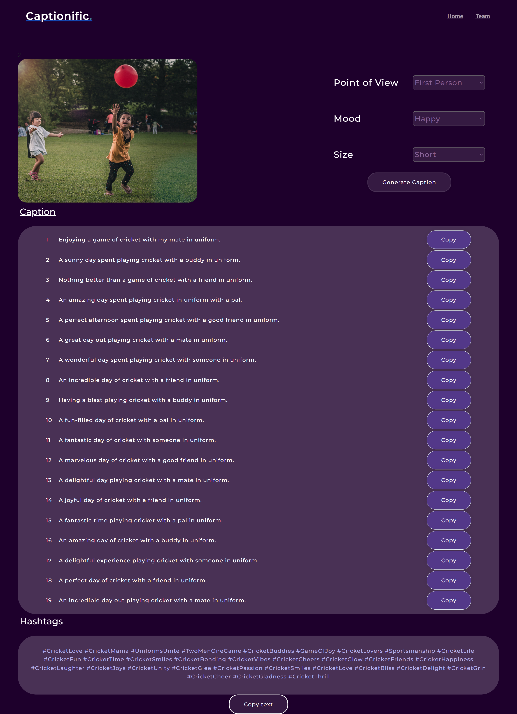
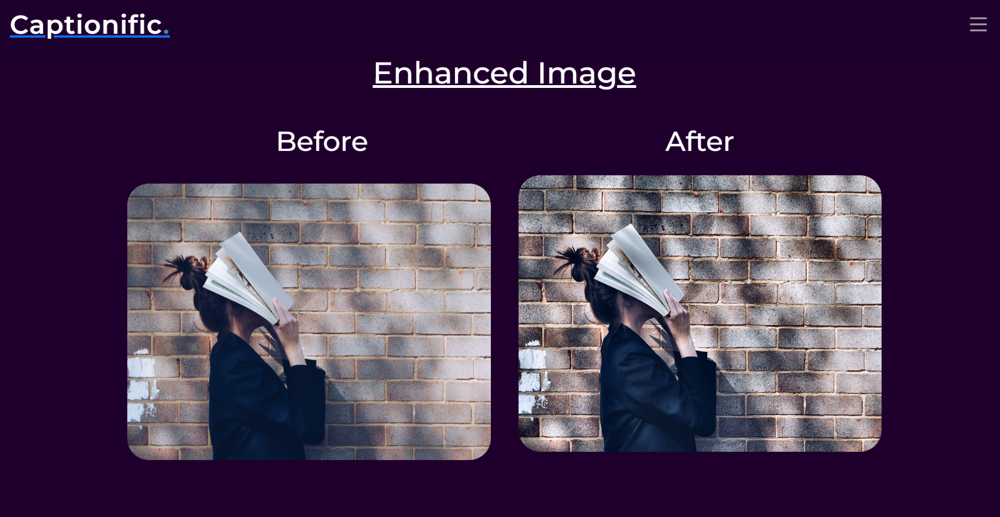

# *Captionific.*
## Image Summarizing, Caption Generation, Hashtag Generation, Photo Editing

#### Welcome to the Image Processing and Captioning project! This repository combines advanced image summarization, caption generation, hashtag extraction, and photo editing functionalities.

## Overview

In this project, we leverage state-of-the-art techniques to provide a comprehensive set of tools for handling images. From generating concise summaries and captions to extracting relevant hashtags, this repository aims to enhance your image processing capabilities.

## Features

**Caption Generation**: Automatically generate descriptive captions for your images.

**Image Summarization**: Quickly obtain meaningful summaries of your images.
**Hashtag Extraction**: Extract relevant hashtags to enhance your social media presence.

**Photo Editing**: Apply various filters and enhancements to your images.

**Technologies**:  

## Contributing

We welcome contributions from the community! Feel free to open issues, submit pull requests, or provide suggestions to enhance the functionality of this project.
